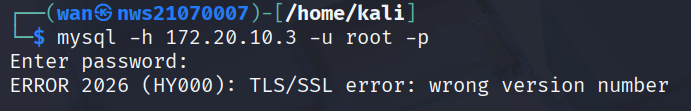

# 💻 Cryptographic Attacks: Cracking Weak Password Hashes and Exploiting Poor Authentication in Databases

## 🧠 A. Lab Objectives

1. Identify and exploit cryptographic weaknesses in database authentication and password storage.
2. Perform offline hash cracking after discovering password hashes in a vulnerable database.
3. Investigate real-world cryptographic failures and propose secure solutions.
4. Document findings clearly in GitHub (Markdown) and present a short demo/debrief.

---

## 🔍 B. Lab Tasks

### 1. Service Enumeration and Initial Access

#### ✅ Objective:
- Identify the database service running on the target.
- Attempt to connect to the database service from Kali Linux.
- Observe any errors during the connection attempt and investigate the issue.

---

#### 🛰️ Step 1: Service Identification

Using network scanning techniques (such as `nmap`), the database service running on the target was identified as **MySQL**.

---

#### 🔌 Step 2: Attempting to Connect from Kali

The following command was used to connect to the MySQL service on the target machine:

```bash
mysql -h 172.20.10.3 -u root -p
```



- Encountered error: `ERROR 2026 (HY000): TLS/SSL error: wrong version number`

**Problem Encountered:**  
MySQL was enforcing SSL/TLS but Kali client was using mismatched protocol.

**Resolution:**  
Disabled SSL in the connection:

```bash
mysql -h 172.20.10.3 -u root --ssl=off
```


**Verification:**  
Successfully accessed the database and listed databases using `SHOW DATABASES;`

---
### 2. User Enumeration and Weak Authentication

Once connected to the MySQL server, I began by listing the available databases using the following command:
```sql
SHOW DATABASES;
```
-------
Next, I selected the `dvwa` database using the following command:
```sql
USE dvwa;
```

---
I retrieved the list of tables using the following command:
```sql
SHOW TABLES;
```

---
I identified a `users` table and executed the following query:
```sql
SELECT * FROM users;
```

---
### ⚠️ Security Question

> **Q:** Is accessing a database without a password a cryptographic failure?  
> **A:** Yes — accessing a database without a password still constitutes a **cryptographic failure**, even though you can access the database directly. Here's why:

1. **Lack of Authentication**:  
   A database that allows access without requiring a password effectively has no authentication mechanism in place. This **bypasses secure authentication protocols** such as password hashing and encryption, leaving the system vulnerable to unauthorized access.

2. **Misconfiguration**:  
   If a database accepts connections without any password, it means the server has been misconfigured, creating a severe security gap. It violates the **core principles of access control**, where systems should only grant access after verifying the user's identity through secure methods.

3. **Increased Risk of Unauthorized Access**:  
   Although you may be able to access the database without a password, **attackers can exploit this same weakness** to gain unauthorized access. This opens the door for malicious actors to steal, modify, or destroy data.

4. **No Cryptographic Protection**:  
   Secure cryptographic practices require using mechanisms like hashed passwords or public key infrastructure to ensure data remains protected. Accessing a database without a password **compromises both the confidentiality and integrity** of the system.

---

### ✅ Conclusion

While you can access the database without a password, this exposes the system to **serious security vulnerabilities** and is a **critical failure of cryptographic authentication**. Proper authentication should always be enforced to protect sensitive data and maintain system security.

---
### 3. Password Hash Discovery and Hash Identification

#### ✅ Instructions:
- Investigate the available databases and identify any tables containing password hashes.
- Extract and list the hashes found.


#### ⚠️ Hint:
> One of the databases contains user credentials stored as password hashes.
```
0d107d09f5bbe40cade3de5c71e9e9b7
```
#### 🛠️ Tools:
- Use hash identification tools such as **hash-identifier** to determine the hashing algorithm used.


#### 🔍 Task:
- Extract the password hashes from the relevant table.
- Use hash identification tools to analyze the hashes and identify the algorithm used.
- Explain the method used to determine the type of hash.

---

### ⚠️ Security Question

> **Q:** What cryptographic weaknesses exist in this hashing method?  
>  
> **A:**  
> The **MD5** hashing algorithm (often identified using tools like `hashid`) is known to have several significant cryptographic weaknesses:

- **🔁 Collision Vulnerabilities**  
  MD5 is susceptible to **collision attacks**, where two different inputs produce the same hash. This can allow attackers to create malicious data with a matching hash.

- **🔓 Brute-Force Vulnerability**  
  Due to its fast computation, MD5 enables attackers to perform **brute-force or dictionary attacks** quickly, trying numerous password combinations efficiently.

- **📚 Rainbow Table Attacks**  
  MD5's speed also makes it a target for **rainbow table attacks**, where precomputed hashes are matched against known hash values to recover original passwords.

  ---

  ## 🧨 4. Offline Hash Cracking

### 🎯 Objective
Crack the extracted password hashes using offline cracking tools to assess the strength and entropy of the stored passwords.

---

### 🛠️ Tools Used
- `john` (John the Ripper)
- `hashcat` (optional)
- `rockyou.txt` wordlist (commonly used for dictionary attacks)

---

### 📝 Steps Performed

1. **Prepare the Hash File**  
   ### 🔹 Step 1: Store Extracted Hashes

Begin by saving the password hashes retrieved from the database into a text file. This file will be used as input for cracking tools like `john` or `hashcat`.

```bash
echo "0d107d09f5bbe40cade3de5c71e9e9b7" > hashes.txt
```

---
### 🔹 Step 2: Crack the Hash Using John the Ripper

Use **John the Ripper** along with a commonly used wordlist like `rockyou.txt` to attempt cracking the stored hashes:

```bash
john --wordlist=/usr/share/wordlists/rockyou.txt hashes.txt
```


# Display All Cracked Passwords

To display all the cracked passwords, use the following command:

```bash
john --show --format=raw-md5 hashes.txt
```

---

## Cracked Password Information

- **Cracked Password**: `letmein`
- **Hash Type**: Raw-MD5
- **Hash Cracked**: Successfully cracked the hash.
- **Cracking Speed**: 100.0g/s (100 billion guesses per second)

### 5. Cryptographic Analysis and Mitigation

| **Issue**                     | **Description**                                                                 | **Mitigation**                                                                 |
|-------------------------------|---------------------------------------------------------------------------------|--------------------------------------------------------------------------------|
| No Password on DB Account     | MySQL allowed root access without a password when `--ssl=OFF` was used.          | Set a strong password for all database accounts, disable root login remotely, and enforce `--ssl=ON` to ensure encrypted connections. |
| Weak Hash Algorithm (MD5)     | User passwords were stored using the outdated MD5 hashing algorithm.             | Implement stronger hashing algorithms such as **bcrypt**, **scrypt**, or **Argon2** with proper salting to improve security. |
| Easy-to-Crack Passwords       | Cracked passwords like `password` were found using the `rockyou.txt` wordlist.   | Enforce a password policy that requires a mix of characters, a minimum length, and regular password changes. Implement multi-factor authentication (MFA) where possible. |
| No Encryption in Transit      | Sensitive data (like passwords) may be transmitted in plaintext, vulnerable to interception. | Use **SSL/TLS** for encrypting communication between client and server. Ensure all data is sent over HTTPS to prevent Man-in-the-Middle (MitM) attacks. Use tools like Wireshark to monitor network traffic. |
